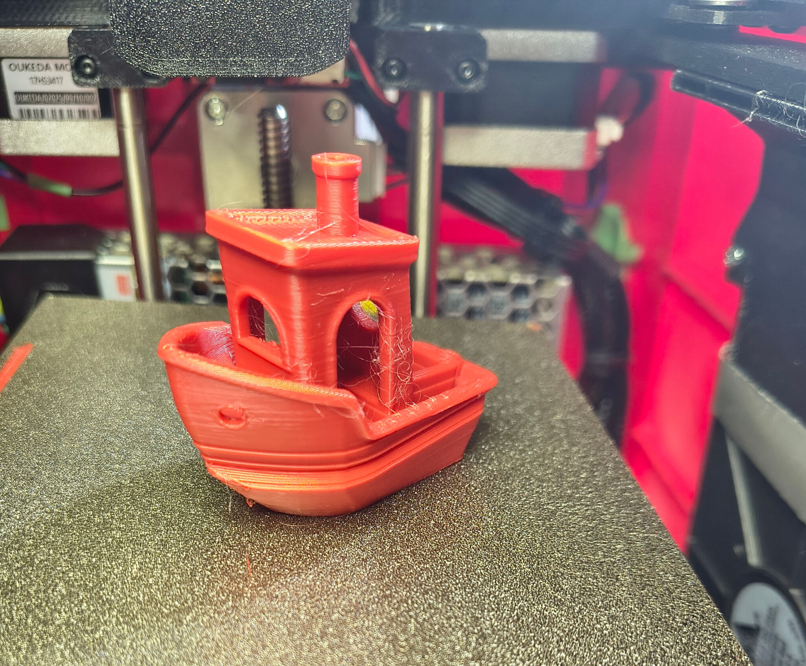

# My Encore Build

> **Work in progress:** This repository documents an independent build of the open-source [Encore CoreXY printer](https://github.com/alexyu132/encore) designed by Alex Yu. Start with the original project for the authoritative design and assembly information. https://www.printables.com/model/1743331-encore-mini-corexy-3d-printer-with-a-fully-printed/files

My Encore Build uses a compact 120 × 120 mm bed, a BTT SKR Mini E3 V3.0, Raspberry Pi Zero 2 W, Klipper and a Creality K1 direct-drive extruder. This repository records the changes, troubleshooting and tuning that produced a reliable working printer.

## Current status

- Printing successfully with the recurring sideways layer shift resolved.
- XY current raised from 0.580 A to 0.700 A RMS; both motors measured about 38 °C.
- Maximum acceleration set to a reliable 3500 mm/s² and matched in OrcaSlicer.
- A 10 × 10 × 10 mm calibration cube measured within approximately 0.25 mm.
- The CoreXY belt-tension matcher reproduced its stated 0.03 mm difference.
- Final PLA temperature, retraction, pressure advance and input-shaping work remains in progress.

## Main changes from the original build

| Area | This build | Result or reason |
|---|---|---|
| Controller | BTT SKR Mini E3 V3.0 | Integrated TMC2209 drivers and a practical Klipper base |
| Host | Raspberry Pi Zero 2 W | Runs Klipper, Moonraker and Mainsail |
| MCU connection | USB rather than the attempted UART link | Stable communication and simpler setup |
| Extruder | Creality K1 direct drive | Short filament path and improved extrusion control |
| Motion | Corrected pulley/belt arrangement and matched belt behaviour | Removed repeating first-layer banding and reduced rough motion |
| Cooling | Two 12 V side fans through a 24-to-12 V converter | Additional part cooling |
| Logic power | LM2596 24-to-5 V supply for Pi and ESP32/CYD | Pi is stable; intermittent ESP32 resets are still being investigated |

## Confirmed tuning baseline

| Setting | Value |
|---|---:|
| Kinematics | CoreXY |
| Nominal build area | 120 × 120 mm |
| Maximum velocity | 300 mm/s |
| Maximum acceleration | 3500 mm/s² |
| Maximum Z velocity | 5 mm/s |
| Maximum Z acceleration | 100 mm/s² |
| X/Y run current | 0.700 A RMS |
| K1 extruder run current | 0.650 A RMS |
| Nozzle / filament | 0.4 mm / 1.75 mm |

These are results from this particular machine, not universal Encore defaults.

## Repository contents

- [`config/`](config/) — reviewed configuration excerpts and macro documentation.
- [`docs/build-notes.md`](docs/build-notes.md) — hardware and commissioning notes.
- [`docs/wiring.md`](docs/wiring.md) — known wiring information and checks still required.
- [`docs/tuning-log.md`](docs/tuning-log.md) — dated tuning history and next tests.
- [`docs/parts-list.md`](docs/parts-list.md) — confirmed components and missing details.
- [`slicer/OrcaSlicer-profile-notes.md`](slicer/OrcaSlicer-profile-notes.md) — confirmed slicer settings and tuning plan.
- [`models/`](models/) — See remix folder on Printables for this project
## Before using the configuration

The files in `config/` are documentation excerpts, not a complete drop-in configuration. Pin assignments, thermistor types, endstop logic, directions, dimensions and MCU serial paths must be checked against the actual machine. Never copy Wi-Fi credentials, API keys, passwords or another printer's unique serial path.

## Remaining work

- Record the complete working `printer.cfg` after removing private and machine-unique data.
- Add final printer, electronics, belt-routing, direct-drive and wiring photographs.
- Confirm exact motor, pulley, belt, fan, converter and fastener details.
- Repeat the stringing test at 205 °C, starting with 0.5 mm retraction at 40 mm/s.
- Tune pressure advance, then fit an accelerometer and tune input shaping.
- Investigate the intermittent ESP32/CYD resets.
- Add any modified STL and source files with print settings and clear attribution.
- Select a licence before public release; see [`LICENSE`](LICENSE).

## Attribution

Encore is an open-source project by Alex Yu. This repository is an independent build record and is not a replacement for the [original Encore repository](https://github.com/alexyu132/encore). Any original or modified parts added later must retain their applicable upstream attribution and licence notices.
